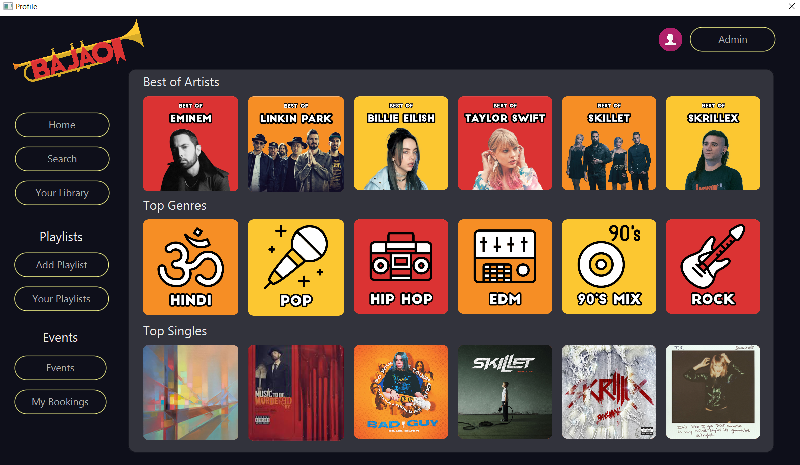
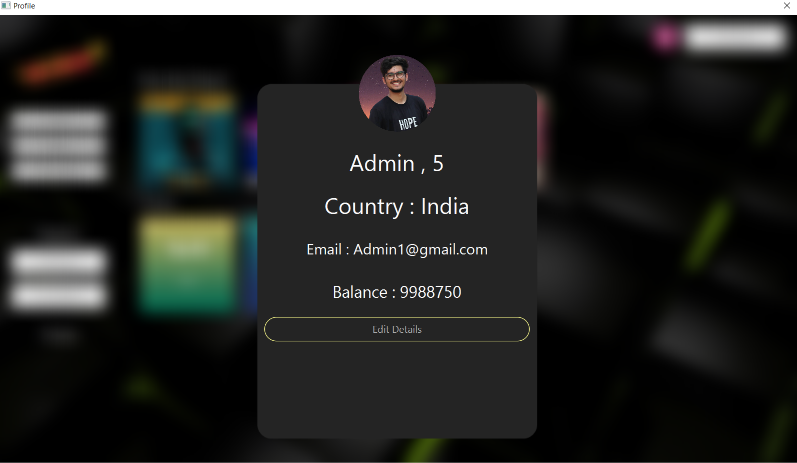
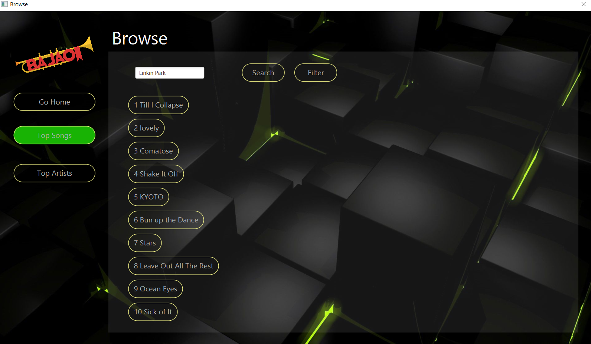
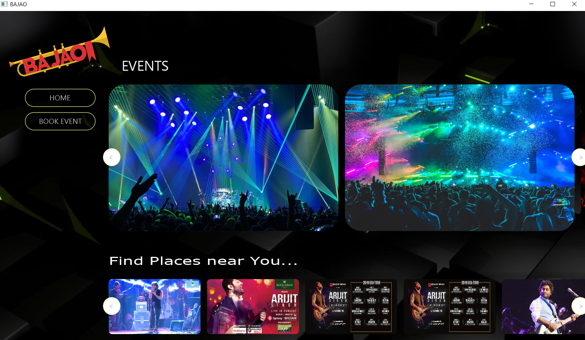

# Music-streaming-and-Event-Booking-app 

by Team members : Arka Sarkar, Dhruv Yadav, Nikhil Dahiya, Amit Maurya, Harman from **Indraprastha Institute of Information Technolofgy, New Delhi**

## Application 

The aim of this project is the development of **mobile music streaming and event ticket booking application**. The application has an **online music store** where our users can choose what songs to listen to and also create **online** playlists. Our audience can buy a **premium subscription** for an **ad-free experience**. The application also enables the user to **search and book concert tickets**. 
**Musical professionals would upload their songs** to the database for our audience to listen to.  
**Advertisers can post Ads** for their products. **Event Organisers** can post **events and live concerts**, and **tickets for live concerts** would be sold by **ticketing services** on our application.  
All the transactions would be handled by the **banking services** affiliated with our company. 

## Stakeholders

* **Musicians** - Willing to upload their songs to a wider audience
  * Singers
  * Bands
  * Indie artists
  * DJs
  * Instrumentalists
* **Audience/ General Public** - Willing to listen to songs in their leisure time
* **Music Event Handlers/ Organizers** - Willing to publicize their event and sell tickets for the same
* **Event Ticket Buyers** - Willing to buy tickets for the said music events
* **Bankers** - Willing to gain profit by the utilization of their services in our app for selling tickets
* **Advertisers** - Willing to advertise their product on our app

## Stakeholder Queries 
* **Musicians - Bands, DJs, Singers, producers, ...**
  * Check their current popularity.
  * Find the number of views on their latest song.
  * Check out which are their most popular songs.
  * Compare their statistics with artists of a similar genre.
  * Release their new song.
  * Remove their old album from 2003.

* **Users/Audience - Students, Families, Individuals, ...**
  * Find all the concerts happening in New Delhi in the next 3 months.
  * Make a new playlist.
  * Book tickets of a live concert
  * Find the top trending songs
  * Listen to a playlist by their favourite artists.
  * Rate a Live Performance.
  * Search for a specific song.

* **Advertiser - Companies, Sponsors,..**
  * Start a new ad campaign.
  * Calculate the advertising cost for one day.
  * Get the total money spent on ads this month.
  * Delete an advertisement.
  * Updating the current ad Display.
* **Event Organisers**
  * Get the price of an artist.
  * Check for the availability of an artist.
  * Find the best English band in the available budget.
  * Fetch the singer with more than 5 hits and price under 5,00,000.
  * Contract with Artist and fee payment.
  * Checking Sponsors for an event.
  * Setting a schedule for different artists.
  * Fetching the payment made to the Artist.

* **Bankers**
  * Get all the transactions made by a particular user in the past year.
  * Refund a particular transaction
  * Find all the users who have made transactions in a different currency.
  * Fetch the payment made by an advertiser.
  * Transferring amount from users to event organizers.

* **Ticketing Services**
  * Sell tickets for a new live concert.
  * Get how many tickets are bought by somebody.
  * Get how many tickets of ₹ 5000/- were sold in the last concert by Linkin Park.
  * Fetch tickets that were added by an event organizer last month.
  * Find out which event sold the least tickets last month.

## Database Schema

## UI

## Contact

For any furhter queries feel free to reach out the following contributors.  

Arka Sarkar (arka18222@iiitd.ac.in)   
Dhruv Yadav (dhruv18281@iiitd.ac.in)  
Harman Singh (harman18284@iiitd.ac.in)  
Amit Maurya (amit18015@iiitd.ac.in)  
Nikhil Dahiya (nikhil18057@iiitd.ac.in)  

